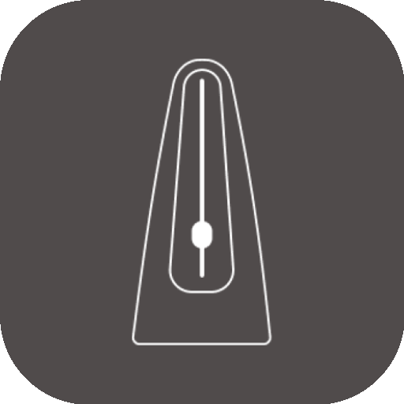
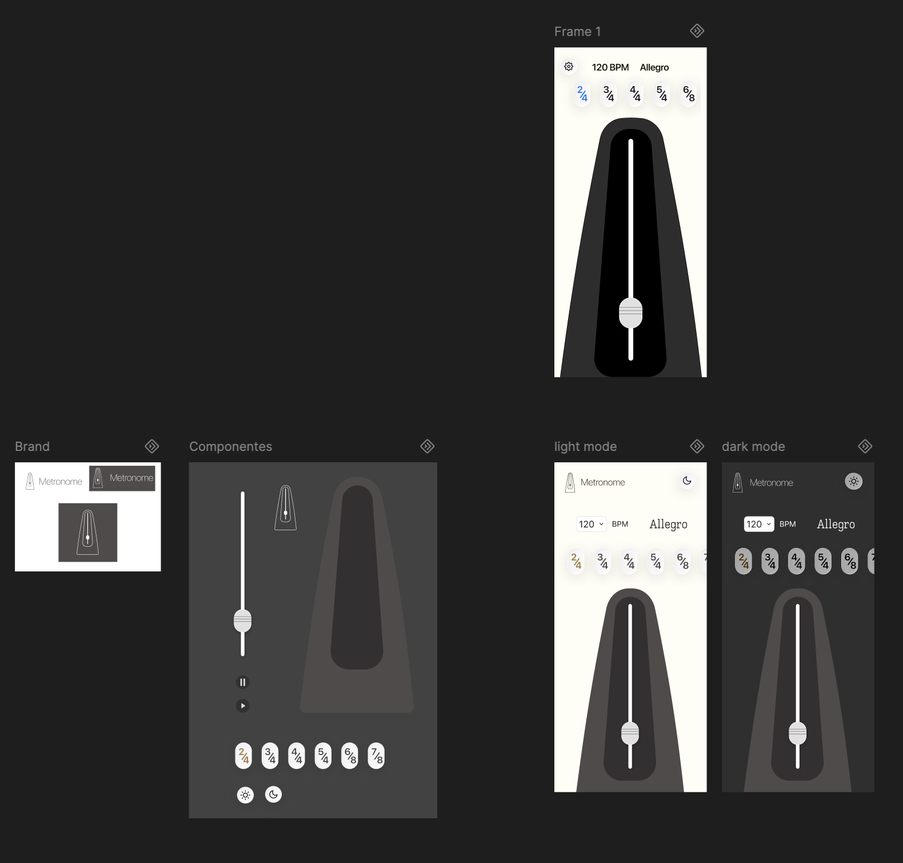

#  Metronome App

Android metronome built with a focus on precision and a UI based on physical components.

<p align="center">
  
</p>

## Features

* **Self-correcting audio engine**: keeps BPM steady even with system performance fluctuations.
* **Interactive pendulum**: dragging the weight along the rod adjusts BPM following the classic scale.
* **Dual control**: linear slider (1 BPM precision) and pendulum (classic scale).
* **Themes**: full support for dark and light mode.
## Tech stack

* Kotlin + Jetpack Compose
* Coroutines
* SoundPool
* SplashScreen API
## Requirements

* Android Studio Koala or newer
* JDK 17+
* Device/emulator with API 24+
## Setup and run

1. Open the project in Android Studio (Koala+).
2. Sync Gradle.
3. Run on a device with API 24+.
## Building the APK

```bash
./gradlew :app:assembleDebug
```

Output location: `app/build/outputs/apk/debug/app-debug.apk`

For a signed release build: `./gradlew :app:assembleRelease` (requires `signingConfig` set up in `build.gradle`).

## Custom sounds

To use your own sounds, place `.wav` files in `app/src/main/res/raw/`:

* `primary_click.wav` — first beat of the measure.
* `intermediate_click.wav` — user-accented beats.
* `normal_click.wav` — regular beats.
## Design specs

* **Grid**: 8dp base.
* **Side margins**: 24dp.
* **Spacing between blocks**: 24dp.
* **Colors**: defined in `ui/theme/Color.kt`.
## Project structure

```text
app/src/main/java/com/metronome/app/
├── MainActivity.kt         # Entry point
├── MetronomeScreen.kt      # Main UI and animation logic
├── MetronomeEngine.kt      # High-precision audio engine
├── Tempo.kt                # BPM to tempo name mapping
├── Constants.kt            # Shared constants (BPM steps, swing degrees)
├── components/             # Reusable UI components (Pendulum, Sliders, etc.)
├── models/                 # Data models (TimeSignature)
└── ui/theme/               # Design system (Colors, Type, Theme)
```
